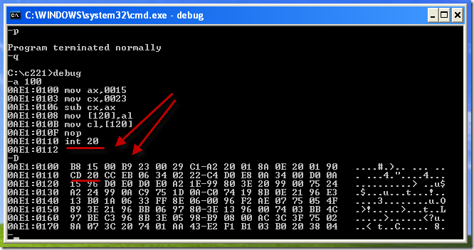

<center > 北京师范大学2018-2019学年第一学期 “汇编程序设计” </center>

<center><font size=8><b>上机作业七</b></fontfont></center>


| 姓    名 |   学    号   | 日    期  |
| :------: | :----------: | :-------: |
|   张三   | 201511112222 | 2018.11.8 |


## 实验目的

* **ret、retf、call 指令的应用。**
* **学会子程序设计**
* **mul 乘法指令的应该用**


##  实验总结：

总结中要写出自己对问题的分析，而不是简单的贴图贴代码。

### 第 1 题

8086汇编不支持数据直接搬移到段寄存器中，所以需要两部设置ds段

```assembly
mov ax 1001h ；因为不能直接将立即mov到段寄存器，所以先mov到ax中
mov ds ax    ；再将ax中数据mov到数据段寄存器ds中
```

 




### 第 2 题

设计为16位数的乘法，所以结果矩阵中每个元素使用32位保存。

```assembly
mov ax 1001h ；因为不能直接将立即mov到段寄存器，所以先mov到ax中
mov ds ax    ；再将ax中数据mov到数据段寄存器ds中
```

